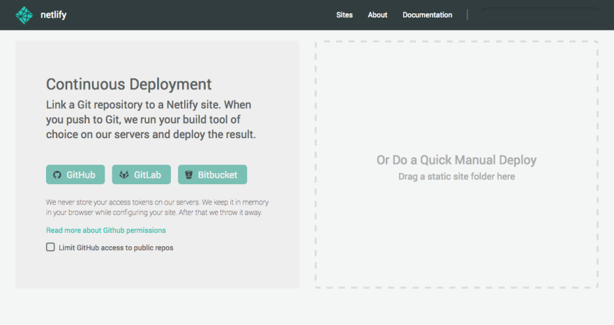
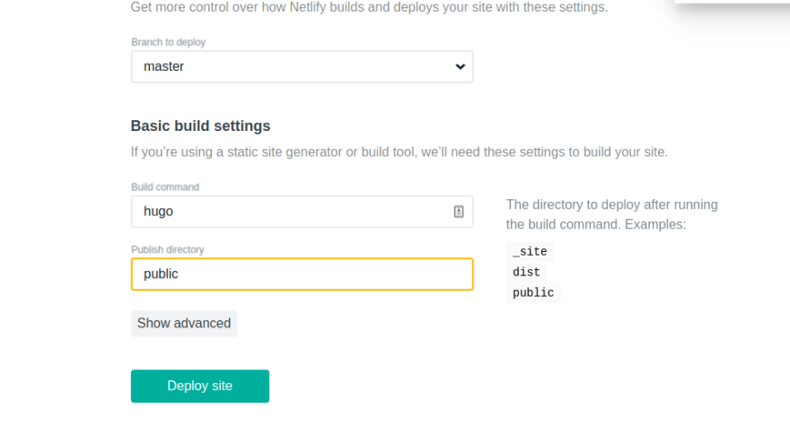
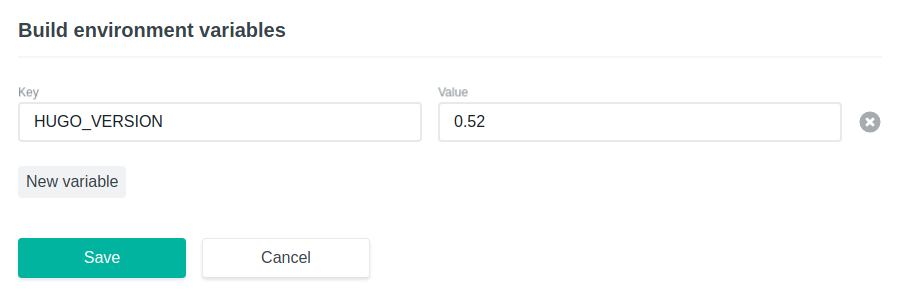

# 1.To know how it works

## 1.Why Hugo

You should know there are [sorts of blogs](https://segmentfault.com/a/1190000011661576).

[Jeklly and Hugo](https://linux.cn/article-8633-1.html) are similar and different.

## 2.Why Netlify

the workflow of Netlify

{}

The advantage of Netlify is that it saves you from uploading your codes to the server, it automatically deploys the updates on the GitHub. Under some circumstances it is very useful.


# 2.Implementation

## 1.Buying domain

[哪里买域名](https://www.zhihu.com/question/19551906)

Why Namesilo 

6.99$ per year

coupon YMYH > 5.99$ per year

## 2.Hugo

### 1.Installation

[Official Documentation](https://gohugo.io/getting-started/installing/)

#### Debian and Ubuntu

```
sudo apt-get install hugo
```
Though by this way, the version isn't the latest. So you can download the package from [Hugo release](https://github.com/gohugoio/hugo/releases), and install by 
```
sudo dpkg -i hugo_0.52_Linux-64bit.deb
```

To check, 

```
hugo version
```

### 2.Generate local site

By

```
hugo new site yoursite
```

Hugo will generate the catalog yoursite, in which you will see following :

```
archetypes/
content/
layouts/
static/
config.toml
```

Normally, you can post the first Markdown Document by:

```
cd mysite
hugo new about.md
```

### 3.Import a theme

Choose a theme from [offered themes](https://themes.gohugo.io/), you can only clone other's themes or  add templates into `layouts` and css into `static`.

```
cd themes
git clone https://github.com/shenoybr/hugo-goa
cd ..
```

Some themes contain detailed guidance, like the one I used.

### 4.Deploy locally

Firstly, you need to override the config.toml, simply you can just use the author's settings in his site, and modify it later to your taste.

```
hugo server -t hugo-goa --buildDrafts --watch
```
or
```
hugo server -w -v
```
You need to open, say for my theme, http://localhost:1313 in the browser.


This is basically all the work to do for Hugo.


## 3.GitHub

You need a GitHub account, copy yoursite catalog to your repository for Netlify to automatically grasp.


## 4.Netlify

[Hugo's tutorial: Host on Netlify](https://gohugo.io/hosting-and-deployment/hosting-on-netlify/)

[Netlify's tutorial]()

### 1.First, sign up with GitHub or email account.



### 2.Second, deploy your site.



So, it's pretty much simple. But you may encounter such errors.

One of the most possible is that the version of Hugo on Netlify's servers is different from yours according to [the official documents](https://www.netlify.com/docs/build-gotchas/?_ga=2.163521084.1480081095.1543722703-692151905.1543722703#hugo). And the easiest way to solve this is to add an environment variable in deploy settings as KEY: "HUGO_VERSION", VALUE: "yourversion".



Or you can also upload a `netlify.toml` file:

```
[context.deploy-preview.environment]
  HUGO_VERSION = "0.52"
```


### 3.You may need to manage your Domain

This is [Official Doc](https://www.netlify.com/docs/dns/)

When you deploy your website codes, Netlify automatically assigns you a subdomain of itself, like "xxx.netlify.com". You may also use your own domain. You can change your DNS records in where you bought your domain, or other ways. To pay attention, Netlify DNS supports the following types of records: A, AAAA, ALIAS, CAA, CNAME, MX, NS, SPF, SRV, TXT.

Or more conveniently, you can add domains to Netlify DNS that you own through external domain registrars. The final step to making your DNS records live is to update your domain registrar with the nameservers given by Netlify. 


# 3.Final

From searching on the Internet in the beginning to publish the site successfully, it took me 9 hours. If you understands how it works, it can take very soon, maybe just an hour or even less, though your own domain may take one or two days to be updated. My last error was the version of Hugo, after fixing that, deploying was naturally done, which made me so happy. So it is completely not a difficult thing to do. Now, get your blog published!

# 4.References

[怎么选择和快速搭建个人博客](https://segmentfault.com/a/1190000011661576)

[利用hugo搭建个人博客入门教程](https://youngspring1.github.io/2016/2016-03-06-hugo/)

[我的博客是如何搭建的（github pages + HEXO + 域名绑定）](https://www.jianshu.com/p/834d7cc0668d)

[Build a Static Site with Hugo and Deploy with Netlify](https://gohugo.io/hosting-and-deployment/hosting-on-netlify/)

\*[Getting Hugo running on Netlify](https://www.burntfen.com/2017-04-16/getting-hugo-running-on-netlify)

[Hugo Documentation](https://gohugo.io/documentation/)

[Netlify Documentation](https://www.netlify.com/docs/)

[Hugo Themes](https://gohugo.io/documentation/)