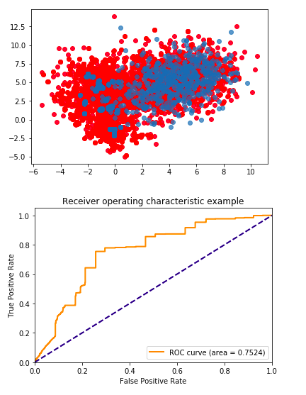

# 0x1. Abstract

## 1. Autoencoder

An autoencoder is a type of artificial neural network used to learn efficient data codings in an unsupervised manner. The aim of an autoencoder is to learn a representation (encoding) for a set of data, typically for dimensionality reduction. It compresses high dimensional data to low, and recovers it to the previous dimension, these are referred to as encoding and decoding.

## 2. Web log file analysis

Web log analysis is to parse a server log file from a web server, and based on the values contained in the log file, derive indicators about when, how, and by whom a web server is visited. Reports are usually generated immediately, but data extracted from the log files can alternatively be stored in a database, allowing various reports to be generated on demand. 

Common indicators are listed below:

1.Number of visits and number of unique visitors 

2.Visit duration and last visits

3.Authenticated users, and last authenticated visits

4.Days of week and rush hours

5.Domains/countries of host's visitors.

6.Hosts list

7.Number of page views

8.Most viewed, entry, and exit pages

9.File types

10.OS used

11.Browsers used

12.Robots used

13.HTTP referrer

14.Search engines, key phrases and keywords used to find the analyzed web site

15.HTTP errors

16.Some of the log analyzers also report on who is on the site, conversion tracking, visit time and page navigation.

## 3. Data source

The HTTP dataset CSIC 2010 contains thousands of web requests automatically generated. It can be used for the testing of web attack protection systems. It was developed at the “Information Security Institute” of CSIC (Spanish Research National Council). The dataset is generated automatically and contains 36,000 normal requests and more than 25,000 anomalous requests. The HTTP requests are labeled as normal or anomalous and the dataset includes attacks such as SQL injection, buffer overflow, information gathering, files disclosure, CRLF injection, XSS, server side include, parameter tampering and so on. 

# 0x2. Core idea

The core idea of the model is to let autoencoder learn the difference between anomalous logs and normal logs. As the autoencoder can only accept matrix, each character is mapped to a number, hence each line of logs is to be mapped to a  row of matrix. This is implemented by calling the function 'textfile_to_semi_redundant_sequences'.

# 0x3. Doings

## 1. Preprocessing

The valuable information is contained in HTTP method, query characters, cookie, header, but because of ways of generation, all the headers are the same--"Content-Type: application/x-www-form-urlencoded", and all the cookies are generated by a certain algorithm, different from each else. Therefore there is no way to analyze them by deep learning method. The author applys the way of transforming each character in the URL except of IP addresses and ports, which are from local and same, and each HTTP method to a specific number. After padding with 0 to match the longest line, the matrix is formed. That's how we get the anomalous data and normal data.

As the anomalous logs contain not only real attacks such as 
"GET http://localhost:8080/tienda1/publico/anadir.jsp?id=2&nombre=Jam%F3n+Ib%E9rico&precio=85&cantidad=%27%3B+DROP+TABLE+usuarios%3B+SELECT+*+FROM+datos+WHERE+nombre+LIKE+%27%25&B1=A%F1adir+al+carrito HTTP/1.1"

In the preprocessing, one point to pay attention to is that some query characteristics in the anomalous logs contain one or several line breaks as such: "GET http://localhost:8080/tienda1/publico/registro.jsp?modo=registro&login=armand&password=prusiato&nombre=any
Set-cookie:+Tamper=5765205567234876235&apellidos=Catalayud+Mirabet&email=balademas.mareuil6@enlanzarote.com.vc&dni=28178710F&direccion=C/+Cala,+9,+&ciudad=Mutxamel&cp=25332&provincia=Zaragoza&ntc=8608089924764976&B1=Registrar HTTP/1.1". These logs contain the attack of HTTP header injection, and they contain more than two line breaks which, if not dealt with, it's easy to seperate them into two logs in the preprocessing. So the author replaces the line breaks with a specific character, transforms the character to the number same as line break, and make them in one line.

## 2. Put the data into autoencoder

After preprocessing the original data, it is to put them into the autoencoder. The codes of implementing the autoencoder is from github: "https://github.com/janvdvegt/autoencoder-anomaly/blob/master/AutoEncoder%20Anomaly%20Detection.ipynb". By experiments of adjusting the number of hidden layers and value size, the author claims that the best already known result appear when the number of hidden layers is set to 108, and value size is set to 6000. In this situation, THE AUC reaches 0.7524.

The red dots are the learned representations of the anomalies while the blue ones are unseen normal examples

# 0x4. Where to improve

## 1. Remove all the normal logs from anomalous data

When at first the anomalous data is used to be the input, the effect is not good.The AUC is merely 0.60 or so. Later the author finds that there are 8 logs that appear in both the anomalous and normal logs, and the total times reach a horrifying 9530 times. They are listed below:

'POST http://localhost:8080/tienda1/publico/anadir.jsp HTTP/1.1\n': 1380 times, 
'POST http://localhost:8080/tienda1/publico/autenticar.jsp HTTP/1.1\n': 1361 times, 
'POST http://localhost:8080/tienda1/publico/caracteristicas.jsp HTTP/1.1\n': 954 times, 
'POST http://localhost:8080/tienda1/publico/entrar.jsp HTTP/1.1\n': 897 times, 
'POST http://localhost:8080/tienda1/publico/pagar.jsp HTTP/1.1\n': 1343 times, 
'POST http://localhost:8080/tienda1/publico/registro.jsp HTTP/1.1\n': 1364 times, 
'POST http://localhost:8080/tienda1/publico/vaciar.jsp HTTP/1.1\n': 919 times, 
'POST http://localhost:8080/tienda1/miembros/editar.jsp HTTP/1.1\n': 1362 times

They are not real attack logs, they are just generated with real ones together. After deleting these logs, the AUC reaches to 0.75, the highest record in the experiments. So actually there are still logs in the anomalous data that are not really attacks, if they were to be removed, the effect will be better.

## 2. Mark specific kind of attack

In the preprocessing, the author didn't specify which kind of attack the log really belongs to, which is a big potential thing to improve. The work may be done as marking all the different attacks with a number at the last column of input matrix, and so are normal logs. The model will still do the binary classification, only that it also predicts the kind of attack.

## 3. The relationship between the distribution of characters and how autoencoder learns

The mapping of characters and number is an essential step. The work is initialized by a function of Tflearn, a deep learning library featuring a higher-level API for TensorFlow. After initializing the mapping, you can distribute them by yourself. The distribution can be regular or disordered, what effect the mapping will bring to the autoencoder remains unknown, maybe no effect either. It is therefore a potential thing to improve. 

## 4. The limitation of the web log file

IP address, header, cookie are what this model doesn't include. As in the dataset, all the IP addresses are from local, meaning the dataset is generated automatically. All the headers are the same, and all the cookies are different, therefore there is no value in analyzing them. But these three kinds of information are indeed useful in practical engineering. 

## 5. Better autoencoder

The effect of the autoencoder itself is also one of the major factors of improving the AUC.

## 6. The hidden layers and the value size

The value size represents the size of data you take as anomalous and normal data, the rest of normal training data will be used to calculate mean and standard deviation of themselves, and to normalize.

When the number of hidden layers is set to approximately one third or two third of the layers of the autoencoder, the effect is better than others. But it still needs a lot of experiments to find and validate it. 

# 0x5. Expansion

Possible expansion of the model is to make it a software which uses the model as one of the kernel detecting models. This model is good at detecting web attacks of existed attacks in this log, so new and unknown types of attacks still need training and learning. We can expect the analysis of IP adress and cookies help us with it, since they track the trace of those suspicious visits.

# 0x6. Tips

This is some experience gained from using tensorflow and anaconda. You can install tensorflow by pip, the package manager. But a more convenient way if you use anaconda is using conda. Conda installs all the necessary and compatible dependencies for the packages as well, which is done automatically. When installing tensorflow, you need to create a virtual environment for it, and you can only activate tensorflow in this environment. It also means that your tensorflow must be installed in this virtual environment, or it will also be able to call in the base environment. This can be easily checked in the anaconda navigator. Knowing these principles, you can better understand the errors reported when using tensorflow.

# Updated on 12/09/18

What if we use variational autoencoder?

As is known that variational autoencoder performs better in dealing with text and gets more attention than autoencoder, so I start an experiment of using a variational autoencoder.

## What is the difference between vae and ae?

Before applying the encoded tensor to your decoder, vae tries to find a distribution which the sampled encoded data belongs to, normally Gaussian Distribution. That means you use the encoded data as the distribution's  mean and standard deviation, and you get the distribution. Then you put the sampled data to your decoder instead of encoded data. The benefit of doing this is making sure the data you put into the decoder obeys its probability distribution.

At last, you need to add the Kullback-Leibler divergence between the encoder’s distribution and a standard Normal distribution to the usual reconstruction loss, so that your neural network minimizes them both.

## Result

The reconstruction loss is extremely large, meaning that vae is not applicable in this case.

## Why is vae not working well?

This is due to the property of the distribution of input data itself. The log file are thousands of lines of records of different length. To make it able to be put into the encoder, we transform the character to integer and pad with 0 to make it a matrix. So there are plenty of 0 in many lines which mostly appear at the end of line. It's easy to find that this is hardly close to a standard Normal distribution, no wonder the reconstruction loss is too large.

Web log files are highly featured, so it's not suitable to apply variational autoencoder in analyzing and  classifying them. Variational autoencoder is normally used in dealing with natural text or pictures to find their latent distribution.